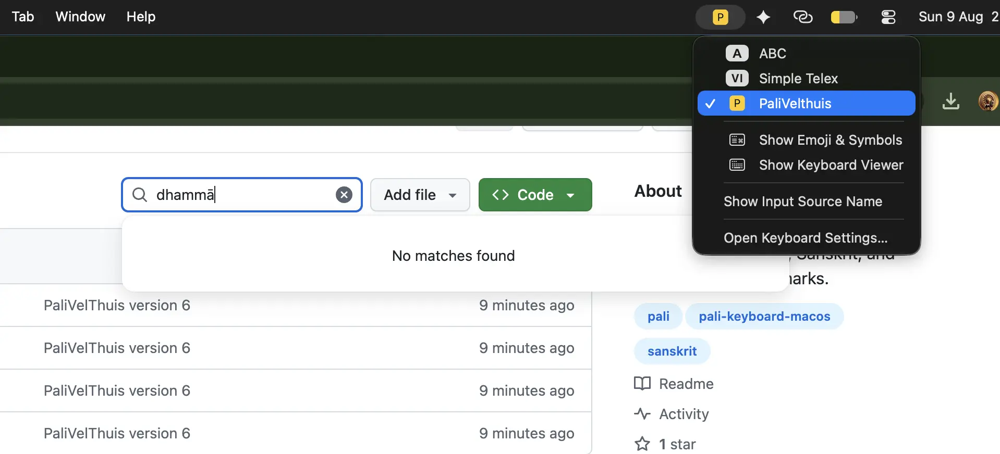

# PaliVelthuis Keyboard Layout for macOS



**PaliVelthuis** is a macOS keyboard layout (`.keylayout`) designed for typing Pali, Sanskrit, and Unicode diacritical marks.

It enhances the original *EasyUnicode v.5 by Tohiya UNEBE*  keyboard layout by integrating **direct Velthuis-style sequence typing**, allowing you to type Pali diacritics directly with standard key combinations without needing to hold down the `Option` (⌥) key.


## 📄 License & Attributions

This project is licensed under the **Creative Commons Attribution 4.0 International (CC BY 4.0)** license, following the original work.

### Attributions

Derived from **EasyUnicode v.5**:
> UNEBE, T. (2019). *EasyUnicode v.5*. Zenodo. https://doi.org/10.5281/zenodo.3373473


---

## 🚀 Quick Start & Typing Reference

Simply type the letter combinations below in normal sequence. The keyboard layout automatically converts them into their corresponding diacritical characters.

### 1. Vowels (Macrons)
| Sequence | Output | Uppercase | Output |
| :--- | :--- | :--- | :--- |
| `aa` | **ā** | `AA` | **Ā** |
| `ii` | **ī** | `II` | **Ī** |
| `uu` | **ū** | `UU` | **Ū** |

### 2. Nasals (Anusvāra & N-variants)
| Sequence | Output | Uppercase | Output | Description |
| :--- | :--- | :--- | :--- | :--- |
| `.m` | **ṃ** | `.M` | **Ṃ** | Anusvāra (dot below) |
| `m..` | **ṁ** | `M..` | **Ṁ** | Niggahīta / Anusvāra (dot above) |
| `.n` | **ṇ** | `.N` | **Ṇ** | Retroflex nasal |
| `~n` or `,,n` | **ñ** | `~N` or `,,N` | **Ñ** | Palatal nasal |
| `"n` or `n..` | **ṅ** | `"N` or `N..` | **Ṅ** | Velar nasal |

### 3. Retroflex & Dot Consonants
| Sequence | Output | Uppercase | Output | Description |
| :--- | :--- | :--- | :--- | :--- |
| `.t` | **ṭ** | `.T` | **Ṭ** | Retroflex t |
| `.d` | **ḍ** | `.D` | **Ḍ** | Retroflex d |
| `.s` | **ṣ** | `.S` | **Ṣ** | Retroflex s |
| `.l` | **ḷ** | `.L` | **Ḷ** | Retroflex l |
| `.r` | **ṛ** | `.R` | **Ṛ** | Vocalic r |
| `.h` | **ḥ** | `.H` | **Ḥ** | Visarga |

### 4. Sibilants & Extended Liquids
| Sequence | Output | Uppercase | Output | Description |
| :--- | :--- | :--- | :--- | :--- |
| `"s` or `s..` | **ś** | `"S` or `S..` | **Ś** | Palatal s |
| `rr.` | **ṝ** | `RR.` | **Ṝ** | Long vocalic r |
| `ll.` | **ḹ** | `LL.` | **Ḹ** | Long vocalic l |

---

## 📝 Typing Examples

| You Type | Result Output |
| :--- | :--- |
| `buddha.m sara.na.m gacchaami` | **buddhaṃ saraṇaṃ gacchāmi** |
| `dhamma.m sara.na.m gacchaami` | **dhammaṃ saraṇaṃ gacchāmi** |
| `san..gha.m sara.na.m gacchaami` | **saṅghaṃ saraṇaṃ gacchāmi** |
| `sa"ngha.m sara.na.m gacchaami` | **saṅghaṃ saraṇaṃ gacchāmi** |
| `manopubban..gamaa dhammaa` | **manopubbaṅgamā dhammā** |

---

## 🛠 Features & Mechanics

- **No Option Key Required**: Type naturally using standard Latin keys.
- **Smart Sequence Fallback**: If a key sequence is non-matching (e.g. typing `a` followed by `p`), the keyboard seamlessly outputs `ap` with zero lag or interruption.
- **Backspace Cancellation**: Pressing `Backspace` (Delete) while in the middle of a dead-key sequence cancels the sequence state without deleting prior text.
- **Legacy Option Key Shortcuts**: All legacy Option (⌥) key shortcuts and dead keys are retained for backwards compatibility.

---

## 📥 Installation on macOS

### Option A: Manual Installation via Finder (No Terminal Required)

1. **Copy the layout files**:
   - In Finder, open the folder containing the downloaded files.
   - Select both **`PaliVelthuis.keylayout`** and **`PaliVelthuis.icns`**.
   - Copy them by pressing `Command (⌘) + C` (or right-click $\rightarrow$ **Copy**).

2. **Open your Keyboard Layouts folder**:
   - In Finder's top menu bar, click **Go** $\rightarrow$ **Go to Folder...** (or press `Shift + Command (⌘) + G`).
   - Type or paste the following path exactly:
     ```text
     ~/Library/Keyboard Layouts
     ```
   - Press `Return` (Enter).

3. **Paste the files**:
   - Paste both files into the `Keyboard Layouts` folder by pressing `Command (⌘) + V` (or right-click $\rightarrow$ **Paste 2 Items**).

4. **Restart or Log Out**:
   - Log out of your Mac user account and log back in (or restart your Mac) so macOS recognizes the new keyboard layout.

5. **Enable PaliVelthuis in System Settings**:
   - Open **System Settings** (or *System Preferences* on older macOS versions).
   - Go to **Keyboard** $\rightarrow$ **Input Sources** (click **Edit...** under Text Input).
   - Click the **`+`** (Add) button.
   - Select **Others** from the sidebar (or search for `PaliVelthuis` in the search box).
   - Click **PaliVelthuis** and click **Add**.
   - Select `PaliVelthuis` from the input source icon in your macOS top menu bar.

---

### Option B: Terminal Command (Advanced Users)

If you prefer using Terminal, run:
```bash
cp "PaliVelthuis.keylayout" "PaliVelthuis.icns" ~/Library/"Keyboard Layouts"/
```
Then log out and enable `PaliVelthuis` under **System Settings** $\rightarrow$ **Keyboard** $\rightarrow$ **Input Sources**.
